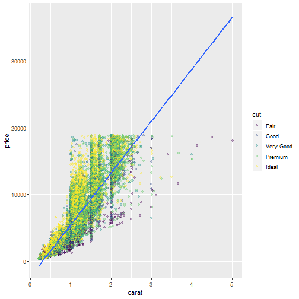

Diamond Price Prediction 
========================================================
author: Wong Jun Xuan
date: 19 - 4 -2019
autosize: true

Introduction
========================================================

This presentation contains documentation for Diamond price prediction application.

This application is built by linear regression models using built-in 'diamond' dataset in R.

The price prediction is based on 4 different variables which are
- Carat
- Color
- Clarity
- Cut

This application does provide a movable plot to let user to visualise how different variable will affect the prediction.

Data in the Apps
=========================================================

This application is using built-in dataset 'diamond' which is part of "ggplot2" package. 

Hence, if you wants to look through all the dataset, you must first to have or install the "ggplot2" package.

The dataset contains information about 53940 diamonds with 10 different variables, but we are more concern on Carat, Color, Clarity, Cut


```r
library(ggplot2)
summary(diamonds)
```

```
     carat               cut        color        clarity     
 Min.   :0.2000   Fair     : 1610   D: 6775   SI1    :13065  
 1st Qu.:0.4000   Good     : 4906   E: 9797   VS2    :12258  
 Median :0.7000   Very Good:12082   F: 9542   SI2    : 9194  
 Mean   :0.7979   Premium  :13791   G:11292   VS1    : 8171  
 3rd Qu.:1.0400   Ideal    :21551   H: 8304   VVS2   : 5066  
 Max.   :5.0100                     I: 5422   VVS1   : 3655  
                                    J: 2808   (Other): 2531  
     depth           table           price             x         
 Min.   :43.00   Min.   :43.00   Min.   :  326   Min.   : 0.000  
 1st Qu.:61.00   1st Qu.:56.00   1st Qu.:  950   1st Qu.: 4.710  
 Median :61.80   Median :57.00   Median : 2401   Median : 5.700  
 Mean   :61.75   Mean   :57.46   Mean   : 3933   Mean   : 5.731  
 3rd Qu.:62.50   3rd Qu.:59.00   3rd Qu.: 5324   3rd Qu.: 6.540  
 Max.   :79.00   Max.   :95.00   Max.   :18823   Max.   :10.740  
                                                                 
       y                z         
 Min.   : 0.000   Min.   : 0.000  
 1st Qu.: 4.720   1st Qu.: 2.910  
 Median : 5.710   Median : 3.530  
 Mean   : 5.735   Mean   : 3.539  
 3rd Qu.: 6.540   3rd Qu.: 4.040  
 Max.   :58.900   Max.   :31.800  
                                  
```

Apps Environment
========================================================

This application use Shiny package to build and the souce code is stored in two different files:
- "ui.R"
- "server.R"

Both files can be found from my github: [Shiny Github repo](https://github.com/enyuin/Shiny-Project)

Plot
========================================================
In the scatterplot below are represented all the data used for prediction model.


```r
    library(ggplot2)
    ggplot(data=diamonds, aes(x=carat, y = price))+
      geom_point(aes(color = cut), alpha = 0.3)+
      geom_smooth(method = "lm")
```


